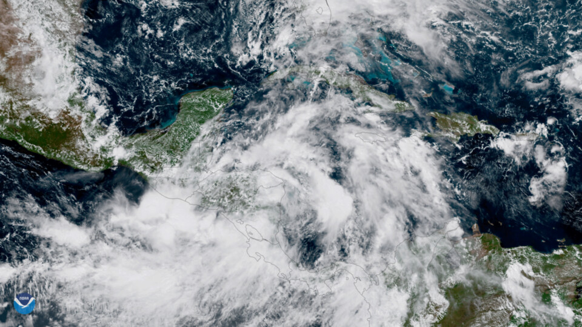

# Perfil académico 

**Nombre**: Nora Machuca Mejía  
**Profesión**: Bióloga  
**email**: norism-m@hotmail.com

## Áreas de interés

1. Medio ambiente
2. Climatología 
3. Hidrología  
4. Paleohidrología

## Curso recibido
- programación R    
    * Datos geoespaciales
- Cursos de Formación
    * Sistemas de información geografíca
    * Gestión del Recurso Hídrico
    
### Link de interes
    
* [ecologia](https://concepto.de/ecologia/)

#### Fotos
1. Foto de Interes 

<strong>Foto de perfil </strong>

<em>Foto

